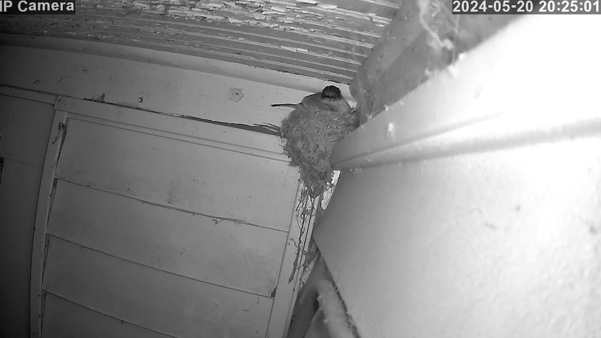

# Birb Cam™



This is a project to put birbs on the internet.  11 years ago I made [chicken cam](https://github.com/jmhobbs/chicken-cam) to stream
my chickens onto the internet.  This is the next version, now that my home internet has fiber, and new, interesting tools are available.

This spring (2024) we had a swallow move in on our back porch and build a nest.  We wanted to watch her raise her eggs, so we set up a cheap
IP camera.  After that, it was a few short steps to publishing it online.  There is nothing novel here, this is just my implementation of
RTSP to HLS.

## Netbirb Diagram

```
┌────────────────────────────┐
│          Mac Mini          │
│                            │       ┌─────────────────────┐
│   ┌────────────────────┐   │       │    Birb Watcher     │
│   │ cloudflared tunnel ├───┼───────┤        (you)        │
│   └──────────┬─────────┘   │       └─────────────────────┘
│              │             │
│   ┌──────────┴─────────┐   │
│   │      birb-cam      │   │
│   └──────────┬─────────┘   │
│              │             │
└──────────────┼─────────────┘
               │                     ┌─────────────────────┐
               │                     │                     │
             rtsp                    │           \\        │
               │                     │          (o>        │
┌──────────────┴─────────────┐       │       \\_//)        │
│    Boavision IP Camera     ├───────┤        \_/_)        │
└────────────────────────────┘       │          _|_        │
                                     │                     │
                                     │       (birb)        │
                                     │                     │
                                     └─────────────────────┘
```
